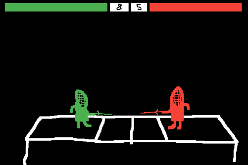
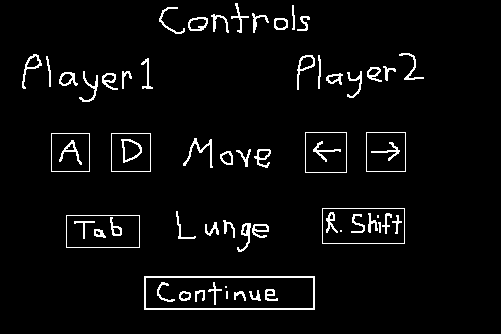
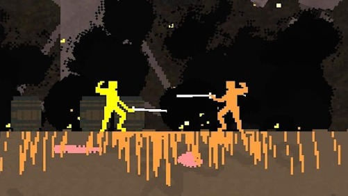

# 3 Button Fencing
  * Home
  * Game Proposal
  * Documentation
  * Project
-------------
  * Concept
  * Genre
  * Platform
  * Story
  * Aesthetic
  * Gameplay
  * Screenshots
  * Developer

## Game Concept
Easy to play but hard to perfect, 3 Button Fencing is a game of masterful distance, timing, and stabbing your friend in fast-paced local multiplayer!

## Genre
This game will be a simple fighting game, having moves mostly derived from real fencing.

## Platform
This will probably be on a desktop only game, as it will require input from 2 players, which will most easily be done with a keyboard.

## Story
It's the 1978 Summer Olympics. It is the grand finals of the men's individual foil fencing event. You play as the American fencer, your opponent, a Soviet fencer. It is the midst of the cold war. A win would not just mean the culmination of your life goal years in the making, but a clear show of superiority of the American athletic program. Everything rests on your shoulders.

## Aesthetic
The art style is going to be fairly abstract, emulating very early video games to immerse the player more in time period. The characters and stage will be pixel art using a very limited color palette. The sound will be 8-bit, with music like early video games, and hit sounds sounding similar to a real fencing scoring machine.

## Gameplay
### Mechanics
The mechanics are fairly simple. It is a very distance based fighting game.
### Control
This will be played with a keyboard. One player will use the WASD keys and the other will use the arrow keys.
### Teaching How to Play
Due to the simple control, they will simply be taught with a quick controls screen when the player starts the game.
### Player Learning
Becoming good at this game will come down to mastering it's simple mechanics. Learning the perfect distance and timing of attacks will be key.

## Screenshots

## Developer
I am Liam Guthrie and I am a second year Game Design and Development major. I have experience in Unity, Unreal, C#, Java, Maya, Photoshop, and Web Development(HTML, CSS).
